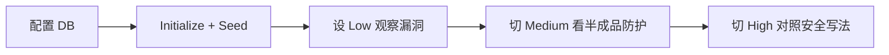

<div align="center">

# 🥥 CocoWeb

**本地 Web 安全靶场 · 离线可玩 · 三档难度**

*在受控环境里亲手「打穿」再「修好」常见漏洞*

<!-- 可爱系徽章：马卡龙配色 + 小表情 -->

[](#)
[](#)
[](#)
[](#)

[](https://www.php.net/)
[](https://www.mysql.com/)
<br/>

[](#)

<sub>马卡龙卡片横幅 · 与站内深色主题同配色（珊瑚 / 薄荷）</sub>

</div>

---

## ✨ 这是个什么东西？

**CocoWeb** 是一套面向学习与演示的 **故意不安全** 的 PHP 应用，内置 **反射型 / 存储型 XSS**、**SQL 注入**、**SSRF**、**CSRF** 等经典课题。通过统一的 **安全等级（Low / Medium / High）** 切换，可以在同一套页面上对比「裸奔 → 半成品防护 → 相对安全」的真实差异。

**界面夯爆了，就不说了，自己领会吧。**

---

## 🧪 实验模块一览

| 模块 | 说明 |
|------|------|
| **XSS Reflected** | 输入原样或经不同策略回显，观察反射型跨站脚本 |
| **XSS Stored** | 留言入库后再次渲染，体验持久化 XSS |
| **SQL Injection** | 在 varying 防护下查询用户数据，理解注入与预处理语句 |
| **SSRF** | 服务端发起请求，观察不同等级下的限制与绕过思路 |
| **CSRF** | 带状态变更的请求与 Token 防护对比 |

---

## 🎚️ 安全等级怎么理解？

| 等级 | 含义 |
|------|------|
| **Low** | 故意脆弱，便于观察攻击面 |
| **Medium** | 简单过滤 / 基础检查（常见「半成品」） |
| **High** | 更接近实践：编码、预处理语句、令牌等 |

在站内打开 **Security Level** 即可全局切换，所有关联实验会随之变化。

---

## 🚀 快速开始

### 环境要求

- PHP（含 `mysqli` 扩展）
- MySQL / MariaDB
- 推荐使用 [phpStudy](https://www.xp.cn/) 等集成环境一键启 Apache + MySQL（Windows 下很常见）

### 安装步骤

1. **克隆或复制** 本目录到 Web 根目录（例如 `WWW/cocoweb`）。

2. **配置数据库**  
   复制 `includes/config.example.php` 为 `includes/config.php`，再填写 MySQL 主机、端口、用户名、密码与库名（默认库名 `cocoweb`）。`config.php` 已加入 `.gitignore`，请勿把真实密码提交到仓库。

   ```php
   'db_host' => '127.0.0.1',
   'db_port' => 3306,
   'db_user' => 'root',
   'db_pass' => '你的密码',
   'db_name' => 'cocoweb',
   ```

3. **浏览器访问** 项目首页，进入 **Initialize Database**（`setup.php`）：
   - 先执行 **Initialize Database** 创建库表；
   - 再可选 **Import Seed Data** 导入 `seed.sql` 中的示例用户与留言。

4. 返回首页，从 Dashboard 进入各实验页，按需调整 **Security Level** 开练。

---

## 📁 目录结构

```
cocoweb/
├── index.php           # 控制台 / 入口
├── setup.php           # 建库、导入种子数据
├── security.php        # 全局安全等级
├── xss_reflected.php
├── xss_stored.php
├── sqli.php
├── ssrf.php
├── csrf.php
├── seed.sql
├── assets/
│   ├── app.css              # 全局样式
│   └── readme-banner.svg    # README 顶部横幅图
└── includes/           # bootstrap、config.example.php、db、layout、security 等
```

> 克隆后请将 `includes/config.example.php` 复制为 `includes/config.php` 并填写数据库密码。

---

## 🗺️ 推荐学习路径



1. 先用 **Low** 把payload打进去，建立直觉。  
2. 再切 **Medium**，思考过滤为什么会被绕过。  
3. 最后看 **High**，对照自己写的修复是否等价。

---

## 🤝 声明

本项目仅用于 **授权环境内的安全教育与自学**。请勿用于未授权测试。使用即表示你理解并接受上述风险与责任。

所有解释权归于CocoWeb本身。

---

<div align="center">

**Happy Hacking · Stay Curious · Fix the Web**

🥥 *CocoWeb — break it locally, build safer habits globally.*

</div>
