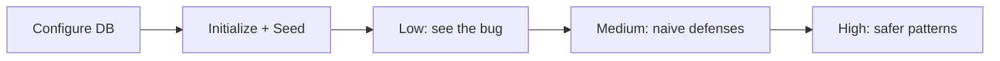

<div align="center">

# 🥥 CocoWeb

**Local web security playground · Offline-friendly · Three difficulty levels**

*Break and fix common issues in a controlled environment*

[](#)
[](#)
[](#)
[](#)

[](https://www.php.net/)
[](https://www.mysql.com/)
<br/>


</div>

---

## ✨ What is this?

**CocoWeb** is an **intentionally insecure** PHP app for learning and demos. It covers **reflected & stored XSS**, **SQL injection**, **SSRF**, **CSRF**, and more. A single **security level (Low / Medium / High)** toggle lets you compare “wide open → naive defenses → safer patterns” on the same pages.

The UI is a polished dark theme—try it yourself.

---

## 🧪 Labs

| Lab | Description |
|-----|-------------|
| **XSS Reflected** | Input echoed back with different defenses—classic reflected XSS. |
| **XSS Stored** | Messages saved and rendered later—persistent XSS. |
| **SQL Injection** | Query user data with varying protection—injections vs prepared statements. |
| **SSRF** | Server-side requests across levels—limits and bypass thinking. |
| **CSRF** | State-changing requests vs token-style defenses. |

---

## 🎚️ Security levels

| Level | Meaning |
|-------|---------|
| **Low** | Deliberately weak—easy to see the attack surface. |
| **Medium** | Naive filtering / basic checks (typical “half-done” fixes). |
| **High** | Closer to practice: encoding, prepared statements, tokens, etc. |

Use **Security Level** in the app to switch globally; all related labs follow.

---

## 🚀 Quick start

### Requirements

- PHP with the `mysqli` extension  
- MySQL or MariaDB  
- Stacks like [phpStudy](https://www.xp.cn/) work well for Apache + MySQL (common on Windows)

### Setup

1. **Clone or copy** this folder under your web root (e.g. `WWW/cocoweb`).

2. **Database config**  
   Copy `includes/config.example.php` to `includes/config.php` and set host, port, user, password, and database name (default DB name: `cocoweb`). `config.php` is listed in `.gitignore`—do not commit real credentials.

   ```php
   'db_host' => '127.0.0.1',
   'db_port' => 3306,
   'db_user' => 'root',
   'db_pass' => 'your_password',
   'db_name' => 'cocoweb',
   ```

3. **Open the app** in a browser, go to **Initialize Database** (`setup.php`):  
   - Run **Initialize Database** to create schema;  
   - Optionally **Import Seed Data** from `seed.sql`.

4. Return to the dashboard, open each lab, and adjust **Security Level** as needed.

---

## 📁 Layout

```
cocoweb/
├── index.php           # Dashboard / entry
├── setup.php           # DB init & seed import
├── security.php        # Global security level
├── xss_reflected.php
├── xss_stored.php
├── sqli.php
├── ssrf.php
├── csrf.php
├── seed.sql
├── assets/
│   ├── app.css
│   └── readme-banner.svg
└── includes/           # bootstrap, config.example.php, db, layout, security, …
```

> After cloning, copy `includes/config.example.php` to `includes/config.php` and fill in your DB password.

---

## 🗺️ Suggested path



1. Use **Low** first to build intuition with payloads.  
2. Switch to **Medium** and think about why filters fail.  
3. Use **High** as a reference for “good enough” fixes.

---

## 🤝 Disclaimer

For **authorized education and self-study only**. Do not use against systems you do not own or lack permission to test. By using CocoWeb you accept the risks and responsibility.

---

<div align="center">

**Happy hacking · Stay curious · Fix the web**

🥥 *CocoWeb — break it locally, build safer habits globally.*

</div>
